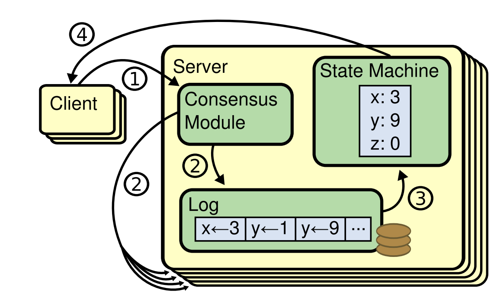

# Getting Started

Raft is a distributed consensus protocol designed to manage a replicated log containing state machine commands from clients.

<p>
    
</p>

Raft includes two major parts:

- How to replicate logs consistently among nodes,
- and how to consume the logs, which is defined mainly in state machine.

To implement your own raft based application with openraft is quite easy, which
includes:

- Define client request and response;
- Implement a storage to let raft store its state;
- Implement a network layer for raft to transmit messages.

## 1. Define client request and response

A request is some data that modifies the raft state machine.
A response is some data that the raft state machine returns to client.

Request and response can be any types that impl `AppData` and `AppDataResponse`,
e.g.:

```rust
#[derive(Clone, Debug, Serialize, Deserialize)]
pub struct ClientRequest {/* fields */}
impl AppData for ClientRequest {}

#[derive(Clone, Debug, Serialize, Deserialize)]
pub struct ClientResponse(Result<Option<String>, ClientError>);
impl AppDataResponse for ClientResponse {}
```

These two types are totally application specific, and are mainly related to the
state machine implementation in `RaftStorage`.


## 2. Implement `RaftStorage`

The trait `RaftStorage` defines the way that data is stored and consumed.
It could be a wrapper of some local KV store such [RocksDB](https://docs.rs/rocksdb/latest/rocksdb/),
or a wrapper of a remote sql DB.

`RaftStorage` defines 4 sets of APIs an application needs to implement:

- Read/write raft state, e.g., term or vote.
    ```rust
    fn save_hard_state(hs:&HardState)
    fn read_hard_state() -> Result<Option<HardState>>
    ```

- Read/write logs.
    ```rust
    fn get_log_state() -> Result<LogState>
    fn try_get_log_entries(range) -> Result<Vec<Entry>>

    fn append_to_log(entries)

    fn delete_conflict_logs_since(since:LogId)
    fn purge_logs_upto(upto:LogId)
    ```

- Apply log entry to the state machine.
    ```rust
    fn last_applied_state() -> Result<(Option<LogId>, Option<EffectiveMembership>)>
    fn apply_to_state_machine(entries) -> Result<Vec<AppResponse>>
    ```

- Building and installing a snapshot.
    ```rust
    fn build_snapshot() -> Result<Snapshot>
    fn get_current_snapshot() -> Result<Option<Snapshot>>

    fn begin_receiving_snapshot() -> Result<Box<SnapshotData>>
    fn install_snapshot(meta, snapshot)
    ```

The APIs have been made quite obvious and there is a good example
[`MemStore`](https://github.com/datafuselabs/openraft/blob/main/memstore/src/lib.rs),
which is a pure-in-memory implementation that shows what should be done when a
method is called.


### How do I impl RaftStorage correctly

There is a [Test suite for RaftStorage](https://github.com/datafuselabs/openraft/blob/main/memstore/src/test.rs),
if an implementation passes the test, openraft will work happily with it.

To test your implementation with this suite, just do this:

```rust
#[test]
pub fn test_mem_store() -> anyhow::Result<()> {
  openraft::testing::Suite::test_all(MemStore::new)
}
```

### Race condition about RaftStorage

In our design, there is at most one thread at a time writing data to it.
But there may be several threads reading from it concurrently,
e.g., more than one replication tasks reading log entries from store.


### An implementation has to guarantee data durability

The caller always assumes a completed write is persistent.
The raft correctness highly depends on a reliable store.


## 3. impl `RaftNetwork`

Raft nodes need to communicate with each other to achieve consensus about the
logs.
The trait `RaftNetwork` defines the data transmission requirements.

An implementation of `RaftNetwork` can be considered as a wrapper that invokes the
corresponding methods of a remote `Raft`.

```rust
pub trait RaftNetwork<D>: Send + Sync + 'static
where D: AppData
{
    async fn send_append_entries(&self, target: NodeId, rpc: AppendEntriesRequest<D>) -> Result<AppendEntriesResponse>;
    async fn send_install_snapshot( &self, target: NodeId, rpc: InstallSnapshotRequest,) -> Result<InstallSnapshotResponse>;
    async fn send_vote(&self, target: NodeId, rpc: VoteRequest) -> Result<VoteResponse>;
}
```

A mock impl in our tests explains what the impl has to do:
[fixture: mock impl RaftNetwork](https://github.com/datafuselabs/openraft/blob/main/openraft/tests/fixtures/mod.rs)


As a real world impl, you may want to use [Tonic gRPC](https://github.com/hyperium/tonic).
[databend-meta](https://github.com/datafuselabs/databend/blob/6603392a958ba8593b1f4b01410bebedd484c6a9/metasrv/src/network.rs#L89) would be a nice real world example.


## 4. Put everything together

Finally, we put these part together and boot up a raft node:

```rust
/// The application data request type which the `MemStore` works with.
///
/// Conceptually, for demo purposes, this represents an update to a client's status info,
/// returning the previously recorded status.
#[derive(Serialize, Deserialize, Debug, Clone)]
pub struct ClientRequest {
    /// The ID of the client which has sent the request.
    pub client: String,
    /// The serial number of this request.
    pub serial: u64,
    /// A string describing the status of the client. For a real application, this should probably
    /// be an enum representing all of the various types of requests / operations which a client
    /// can perform.
    pub status: String,
}
impl AppData for ClientRequest {}

/// The application data response type which the `MemStore` works with.
#[derive(Serialize, Deserialize, Debug, Clone)]
pub struct ClientResponse(Result<Option<String>, ClientError>);
impl AppDataResponse for ClientResponse {}

/// A type which emulates a network transport and implements the `RaftNetwork` trait.
pub struct RaftRouter {
    // ... some internal state ...
}

#[async_trait]
impl RaftNetwork<ClientRequest> for RaftRouter {
    /// Send an AppendEntries RPC to the target Raft node (§5).
    async fn append_entries(&self, target: u64, rpc: AppendEntriesRequest<ClientRequest>) -> Result<AppendEntriesResponse> {
        // ... snip ...
    }

    /// Send an InstallSnapshot RPC to the target Raft node (§7).
    async fn install_snapshot(&self, target: u64, rpc: InstallSnapshotRequest) -> Result<InstallSnapshotResponse> {
        // ... snip ...
    }

    /// Send a RequestVote RPC to the target Raft node (§5).
    async fn vote(&self, target: u64, rpc: VoteRequest) -> Result<VoteResponse> {
        // ... snip ...
    }
}

#[async_trait]
impl RaftStorage<ClientRequest, ClientResponse> for MemStore {
    type Snapshot = Cursor<Vec<u8>>;

    async fn get_membership_config(&self) -> Result<MembershipConfig> {
        // ... snip ...
    }

    async fn get_initial_state(&self) -> Result<InitialState> {
        // ... snip ...
    }

    // ... snip ...
}

#[tokio::main]
async fn main() {
    // Get our node's ID from stable storage.
    let node_id = get_id_from_storage().await;

    // Build our Raft runtime config, then instantiate our
    // RaftNetwork & RaftStorage impls.
    let config = Arc::new(Config::build("primary-raft-group".into())
        .validate()
        .expect("failed to build Raft config"));
    let network = Arc::new(RaftRouter::new(config.clone()));
    let storage = Arc::new(MemStore::new(node_id));

    // Create a new Raft node, which spawns an async task which
    // runs the Raft core logic. Keep this Raft instance around
    // for calling API methods based on events in your app.
    let raft = Raft::new(node_id, config, network, storage);

    let resp = raft.client_write(ClientWriteRequest::new(req)).await?;
}

```

Now it is time to write something to the cluster.
As we did in our tests with `Raft::client_write()`:
[client_writes](https://github.com/datafuselabs/openraft/blob/main/openraft/tests/client_writes.rs)

