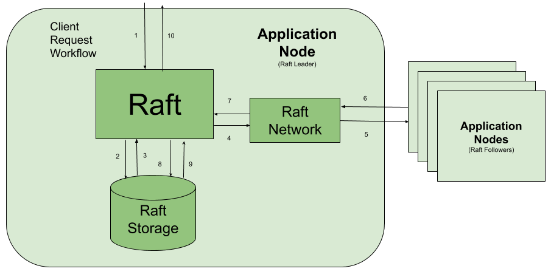

Raft
====
The central most type of this crate is the `Raft` type. It is a highly generic actor with the signature:

```
Raft<D: AppData, R: AppDataResponse, E: AppError, N: RaftNetwork<D>, S: RaftStorage<D, R, E>>
```

The generics here allow `Raft` to use statically known types, defined in the parent application using this crate, for maximum performance and type-safety. Users of this Raft implementation get to choose the exact types they want to use for application specific error handling coming from the storage layer, and also get to work with their application's data types directly without the overhead of serializing and deserializing the data as it moves through the `Raft` system.

### API
As the `Raft` type is an Actix [`Actor`](https://docs.rs/actix/latest/actix/trait.Actor.html), all interaction with `Raft` is handled via message passing. All pertinent message types derive the serde traits for easier integration with other data serialization formats in the Rust ecosystem, providing maximum flexibility for applications using this crate.

All message types are sent to a `Raft` node via the actor's [`Addr`](https://docs.rs/actix/latest/actix/struct.Addr.html). Applications using this crate are expected to have networking capabilities for cluster communication & client interaction. Applications are responsible for handling client requests & Raft RPCs coming from their network layer, and must send them to the `Raft` actor returning the response. More details on this topic can be found in the [network chapter](https://railgun-rs.github.io/actix-raft/network.html).

The public API of the `Raft` type is broken up into 3 sections: Client Requests, Raft RPCs & Admin Commands.

##### Client Requests
- [ClientPayload](https://docs.rs/actix-raft/latest/actix_raft/messages/struct.ClientPayload.html): a payload of data which needs to be committed to the Raft cluster. Typically, this will be data coming from application clients.

##### Raft RPCs
- [AppendEntriesRequest](https://docs.rs/actix-raft/latest/actix_raft/messages/struct.AppendEntriesRequest.html): An RPC invoked by the leader to replicate log entries (§5.3); also used as heartbeat (§5.2).
- [VoteRequest](https://docs.rs/actix-raft/latest/actix_raft/messages/struct.VoteRequest.html): An RPC invoked by candidates to gather votes (§5.2).
- [InstallSnapshotRequest](https://docs.rs/actix-raft/latest/actix_raft/messages/struct.InstallSnapshotRequest.html): Invoked by the Raft leader to send chunks of a snapshot to a follower (§7).

##### Admin Commands
- [InitWithConfig](https://docs.rs/actix-raft/latest/actix_raft/messages/struct.InitWithConfig.html): Initialize a pristine Raft node with the given config & start a campaign to become leader.
- [ProposeConfigChange](https://docs.rs/actix-raft/latest/actix_raft/messages/struct.ProposeConfigChange.html): Propose a new membership config change to a running cluster.


### client requests diagram
The following diagram shows how client requests are presented to Raft from within an application, how the data is stored, replicated and ultimately applied to the application's state machine.

<p>
    
</p>

The numbered elements represent segments of the workflow.
1. The parent application has received a client request, and presents the payload to `Raft` using the `ClientPayload` type.
2. `Raft` will present the payload to the `RaftStorage` impl via the `AppendEntryToLog` type. This is the one location where the `RaftStorage` impl may return an application specific error. This could be for validation logic, enforcing unique indices, data/schema validation; whatever application level rules the application enforces, this is where they should be enforced. Close to the data, just before it hits the `Raft` log.
3. The `RaftStorage` impl responds to the `Raft` actor. If it is successful, go to step 4, else the error response will be sent back to the caller immediately. The error response is a statically known type defined by the parent application.
4. `Raft` uses the `RaftNetwork` impl to communicate with the peers of the cluster.
5. `Raft` uses the `RaftNetwork` impl to replicate the entry to all other nodes in the cluster.
6. Follower nodes in the cluster respond upon successful replication.
7. Once the entry has been replicated to a majority of nodes in the cluster — known as a "committed" entry in the Raft spec — it is ready to be applied to the application's state machine.
8. `Raft` will apply the entry to the application's state machine via the `ApplyEntryToStateMachine` type.
9. The `RaftStorage` impl responds to the `Raft` actor.
10. The success response is returned to the caller.

**NOTE:** this implementation of Raft offers the option for client requests to receive a response once its entry has been committed, and before it is applied to the state machine. This is controlled by the `ClientPayload.response_type` field, which is an instance of the `ResponseMode` enum which may be either `Committed` or `Applied`. Application's may use either depending on their needs.

----

The API is simple enough, but there is more to learn about `Raft` than just feeding it messages. The next logical topic to understand is [Raft networking](https://railgun-rs.github.io/actix-raft/network.html).
